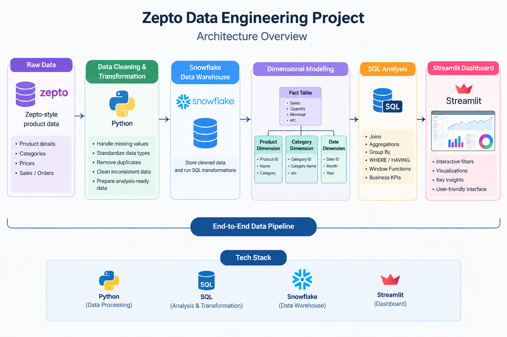

# zepto-data-engineering
## introduction
The Zepto Data Engineering Project is a data analytics and engineering project built using SQL, Snowflake, Python, and Streamlit. The project focuses on processing and analyzing Zepto-style product data to extract useful business insights. It includes data cleaning, SQL-based analysis, dimensional modeling, and an interactive Streamlit dashboard. The project demonstrates how raw data can be transformed into structured, meaningful information using modern data engineering and analytics tools.
## System Architecture

The project follows the architecture shown below:

##  Architecture

  

The architecture ensures that the data is processed efficiently and reaches the final destination in a structured format.

Technologies & Tools
Cloud & Data Platform
Snowflake – Cloud platform for data storage, processing, and management
Snowflake Cloud Storage – Data storage and management within the Snowflake environment
Programming & Data Processing
Python – Application development and data processing
SQL – Data querying, transformation, and analysis
Pandas – Data manipulation and analysis
NumPy – Numerical computing and data processing
Streamlit – Interactive application development within Snowflake
Database & Data Modeling
Generated Dataset – Source data used for the project
DB Browser for SQLite – Used for database inspection and ER diagram creation
Development & Version Control
Visual Studio Code – Development and code editing
Git – Version control
GitHub – Source code management and repository hosting
